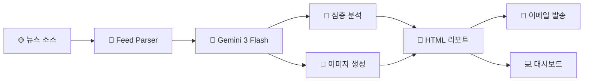

---
tags:
  - 프로젝트
  - AI
  - 해군
  - 자동화
created: 2026-01-14
---

# ⚓ NaviCard AI - 해군 정보 자동화 시스템

> [!info] 프로젝트 개요
> 전 세계 해군/방산 뉴스를 자동으로 수집하고, AI가 심층 분석하여 전문가용 인텔리전스 카드를 생성하는 시스템

---

## 📋 목차
- [[#시스템 개요]]
- [[#주요 기능]]
- [[#시스템 아키텍처]]
- [[#모듈 설명]]
- [[#기술 스택]]
- [[#실행 방법]]
- [[#자동화 설정]]

---

## 시스템 개요



### 핵심 가치

> [!success] 시간 절약
> 4개 해외 매체를 24시간 자동 모니터링

> [!tip] 전문성
> M&S/제어 시스템 관점의 맞춤형 인사이트 제공

> [!note] 자동화
> 매일 오전 7시 자동 실행, 이메일 자동 배달

---

## 주요 기능

| 기능 | 설명 | 사용 AI 모델 |
|------|------|-------------|
| **뉴스 수집** | Naval News, USNI, Defense News, Janes에서 실시간 수집 | - |
| **스코프 필터링** | 함정/USV/제어 시스템 관련만 선별, 단순 무기류 제외 | - |
| **심층 요약** | 원문 안 봐도 될 정도의 상세 기술 분석 | `gemini-3-flash-preview` |
| **전략적 인사이트** | M&S/제어 R&D 관점 전문가 코멘트 | `gemini-3-flash-preview` |
| **AI 이미지 생성** | 뉴스 주제 기반 시네마틱 일러스트 | `gemini-2.5-flash-image` |
| **대화형 대시보드** | 리포트 조회 + AI 질의응답 | `gemini-3-flash-preview` |
| **이메일 발송** | 지정된 수신자에게 HTML 리포트 자동 전송 | - |

---

## 시스템 아키텍처

```
NaviCard_AI/
├── 📁 .github/workflows/
│   └── daily_run.yml      # GitHub Actions 자동화
├── 📁 src/
│   ├── main.py            # 메인 오케스트레이터
│   ├── feed_parser.py     # RSS 뉴스 수집 및 필터링
│   ├── summarizer.py      # Gemini 3 심층 분석
│   ├── image_generator.py # Gemini 2.5 이미지 생성
│   ├── mailer.py          # 이메일 발송
│   └── 📁 templates/
│       └── email_template.html
├── report_dashboard.py    # Streamlit 대시보드
├── run_daily.bat          # Windows 자동화 스크립트
├── requirements.txt
└── .env                   # API 키 (Git 제외)
```

---

## 모듈 설명

### 1. `feed_parser.py` - 뉴스 수집기

> [!abstract] 역할
> 4개 RSS 피드에서 뉴스 수집 및 키워드 필터링

**필터링 로직:**
- ✅ **포함**: USV, Ship Control, IPMS, Frigate, Destroyer 등
- ❌ **제외**: Missile, Torpedo, Gun, Aircraft 등
- ⏰ **시간 필터**: 최근 24시간 이내 발행물만

---

### 2. `summarizer.py` - AI 분석 엔진

> [!abstract] 모델
> `gemini-3-flash-preview`

**출력 필드:**
- `headline_kr` - 한글 헤드라인
- `deep_summary_kr` - 상세 기술 요약
- `technical_specs_kr` - 스펙 데이터
- `strategic_insight_kr` - M&S 관점 인사이트
- `image_prompt` - 이미지 생성용 프롬프트

---

### 3. `image_generator.py` - AI 이미지 생성기

> [!abstract] 모델
> `gemini-2.5-flash-image`

**특징:**
- Rate Limit 자동 재시도
- Base64 디코딩 후 PNG 저장

---

### 4. `mailer.py` - 이메일 발송기

> [!abstract] 프로토콜
> Gmail SMTP SSL (포트 465)

**인증:** 앱 비밀번호 사용 필수

---

### 5. `report_dashboard.py` - 대화형 대시보드

> [!abstract] 프레임워크
> Streamlit

**기능:**
- HTML 리포트 뷰어
- AI 챗봇 (질의응답)

---

## 기술 스택

| 분류 | 기술 |
|------|------|
| **언어** | Python 3.12 |
| **AI** | Google Gemini API |
| **웹** | Streamlit |
| **파싱** | feedparser, BeautifulSoup4 |
| **템플릿** | Jinja2 |
| **이메일** | smtplib (Gmail) |
| **자동화** | GitHub Actions |

---

## 실행 방법

### 로컬 실행

```powershell
# 1. 가상환경 활성화
.\venv\Scripts\activate

# 2. 뉴스 수집 및 리포트 생성
python src/main.py

# 3. 대시보드 실행
python -m streamlit run report_dashboard.py
```

### 환경 변수 (.env)

```env
GEMINI_API_KEY=your_api_key
EMAIL_USER=your_email@gmail.com
EMAIL_PASSWORD=your_app_password
RECIPIENT_EMAILS=recipient1@gmail.com
```

---

## 자동화 설정

### GitHub Actions (클라우드)

> [!important] 스케줄
> 매일 오전 7시 KST 자동 실행

**필요한 Secrets:**
- `GEMINI_API_KEY`
- `EMAIL_USER`
- `EMAIL_PASSWORD`
- `RECIPIENT_EMAILS`

### Windows Task Scheduler (로컬)

> [!tip] 실행 파일
> `run_daily.bat`을 작업 스케줄러에 등록

---

## 📊 출력물 예시

### 카드 뉴스 구성

1. 🎨 **AI 생성 이미지** - 뉴스 주제 시각화
2. 📝 **DEEP SUMMARY** - 기술 상세 요약
3. 📋 **TECHNICAL SPECS** - 제원/스펙 데이터
4. 💡 **STRATEGIC INSIGHT** - M&S/제어 관점 분석

---

## 🔒 보안 고려사항

> [!warning] 주의
> - API 키는 `.env` 파일에 저장 (`.gitignore`로 Git 제외)
> - GitHub에서는 **Secrets**로 안전하게 관리
> - Gmail 앱 비밀번호 사용 (일반 비밀번호 불가)

---

## 관련 문서

- [[GitHub 설정 가이드]]
- [[Gemini API 사용법]]

---

*Created: 2026-01-14*
*Last Updated: 2026-01-14*
